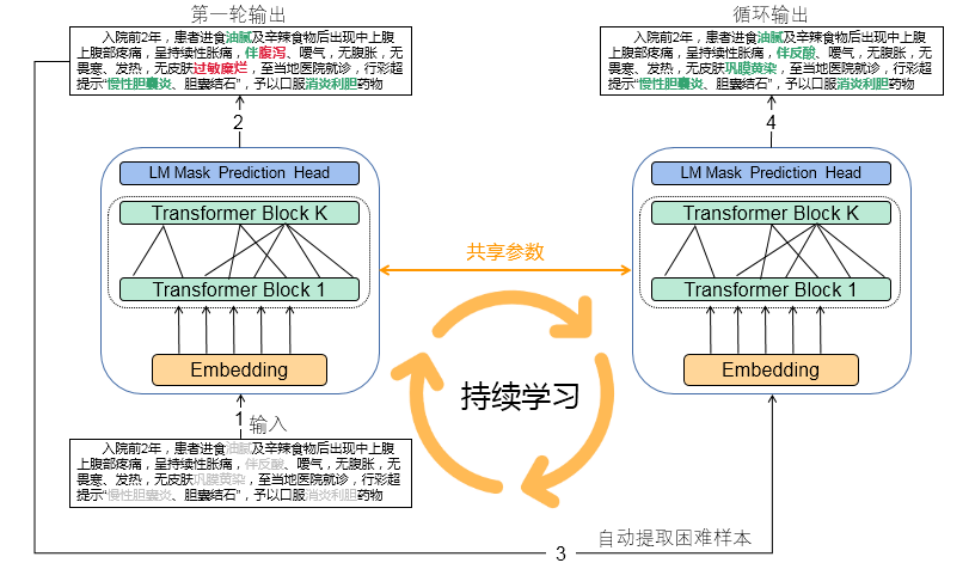
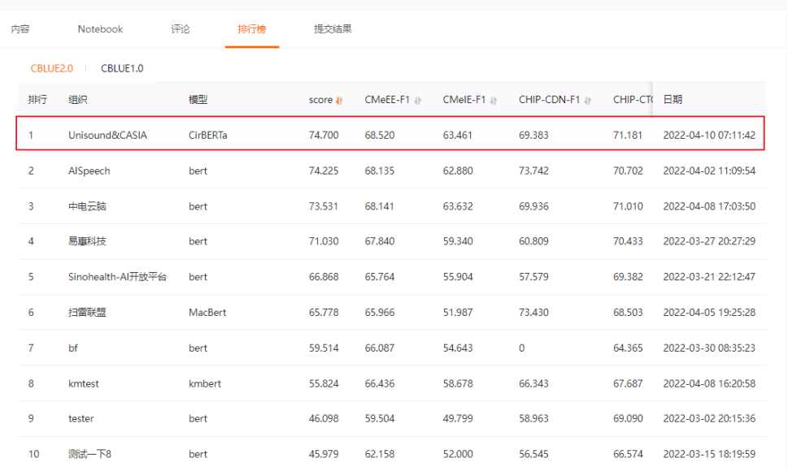

# CirBERTa
Apply the Circular to the Pretraining Model


### 使用通用语料（WuDao 200G) 进行无监督预训练
<center></center>

| 预训练模型            | 学习率 | batchsize | 设备   | 语料库 | 时间 | 优化器 |
| --------------------- | ------ | --------- | ------ | ------ | ---- | ------ |
| CirBERTa-Chinese-Base | 1e-5   | 256      | 10张3090+3张A100 | 200G   | 2月 | AdamW  |

在多项中文理解任务上，12层CirBERTa-Base模型超过24层MacBERT-Chinese-Large/RoBERTa-Chinese-Large

<center></center>

### 加载与使用

依托于huggingface-transformers

```
from transformers import AutoTokenizer,AutoModel

tokenizer = AutoTokenizer.from_pretrained("WENGSYX/CirBERTa-Chinese-Base")
model = AutoModel.from_pretrained("WENGSYX/CirBERTa-Chinese-Base")
```


### 引用:
(暂时先引用这个，论文正在撰写...)
```
@misc{CirBERTa,
  title={CirBERTa: Apply the Circular to the Pretraining Model},
  author={Yixuan Weng},
  howpublished={\url{https://github.com/WENGSYX/CirBERTa}},
  year={2022}
}
```
